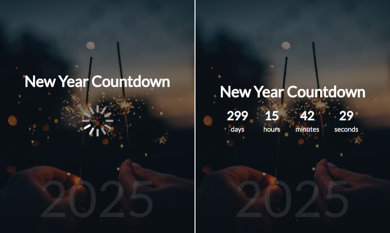

# Udemy--vanillawebprojects-18

**The eighteenth** in a series of **20 small projects** in **Vanilla JavaScript** from the [**Udemy course**](https://www.udemy.com/course/web-projects-with-vanilla-javascript/) by author [Brad Traversy](https://www.traversymedia.com/) with this [Brad's original GitHub repository](https://github.com/bradtraversy/vanillawebprojects).

# 18: New Year Countdown

Landing page that counts down from the current date to the next new year

## Project Specifications

- Create landing page with HTML/CSS
- Calculate the days, hours, mins and seconds to the new year
- Insert values into the DOM
- Show a spinner right before loading the countdown
- Show the coming year in the background

## Original preview

    

## My solution preview

    

## My solution features

- same as an original

- # 18th of 20 Vanilla Javascript project

| ID | Project | URL Link |
|---|---|---|
| 1 | Form Validator | [GitHub link](https://github.com/pettik/Udemy--vanillawebprojects-01) |
| 2 | Movie Seat Booking | [GitHub link](https://github.com/pettik/Udemy--vanillawebprojects-02) |
| 3 | Custom Video Player | [GitHub link](https://github.com/pettik/Udemy--vanillawebprojects-03) |
| 4 | Exchange Rate Calculator | [GitHub link](https://github.com/pettik/Udemy--vanillawebprojects-04) |
| 5 | DOM Array Methods Project | [GitHub link](https://github.com/pettik/Udemy--vanillawebprojects-05) |
| 6 | Menu Slider & Modal | [GitHub link](https://github.com/pettik/Udemy--vanillawebprojects-06) |
| 7 | Hangman Game | [GitHub link](https://github.com/pettik/Udemy--vanillawebprojects-07) |
| 8 | Mealfinder App | [GitHub link](https://github.com/pettik/Udemy--vanillawebprojects-08) |
| 9 | Expense Tracker | [GitHub link](https://github.com/pettik/Udemy--vanillawebprojects-09) |
| 10 | Music Player | [GitHub link](https://github.com/pettik/Udemy--vanillawebprojects-10) |
| 11 | Infinite Scrolling | [GitHub link](https://github.com/pettik/Udemy--vanillawebprojects-11) |
| 12 | Typing Game | [GitHub link](https://github.com/pettik/Udemy--vanillawebprojects-12) |
| 13 | Speech Text Reader | [GitHub link](https://github.com/pettik/Udemy--vanillawebprojects-13) |
| 14 | Memory Cards | [GitHub link](https://github.com/pettik/Udemy--vanillawebprojects-14) |
| 15 | LyricsSearch App | [GitHub link](https://github.com/pettik/Udemy--vanillawebprojects-15) |
| 16 | Relaxer App | [GitHub link](https://github.com/pettik/Udemy--vanillawebprojects-16) |
| 17 | Breakout Game | [GitHub link](https://github.com/pettik/Udemy--vanillawebprojects-17) |
| 18 | New Year Countdown | [GitHub link](https://github.com/pettik/Udemy--vanillawebprojects-18) |
| 19 | Speak Number Guessing Game | [GitHub link](https://github.com/pettik/Udemy--vanillawebprojects-19) |
| 20 | Product Filtering UI | [GitHub link](https://github.com/pettik/Udemy--vanillawebprojects-20) |

# Author

Website - [Petr Bednarski](https://github.com/pettik)  
Frontend Mentor - [@pettik](https://www.frontendmentor.io/profile/pettik)
